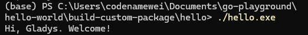

### structure of a simple go project

### to run locally
```
<home>/build-custom-package/
 |-- greetings/
 |-- hello/
```

this creates go.mod in `/build-custom-package`

```
cd greetings
go mod init example.com/greetings
```

```
cd hello
go mod init example.com/hello
```

```
go mod edit -replace example.com/greetings=../greetings
go mod tidy
go run .
```

### to create a binary out of hello.go

```
cd hello
go build -o hello
./hello
```

### on windows

```
go build -o hello.exe
```



### to separate compile greeting as a standard library

this wont create a binary but will compile the package and check for errors

```
cd greetings
go build
```

to create a shared library (a. dll for windows)

```
go build -o greetings.dll
```

greetings.dll cannot be used directly, have not con